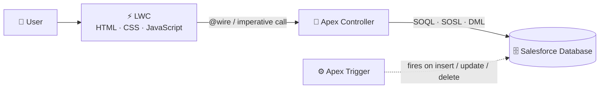

<div align="center">

# ☁️ Salesforce Developer Journey

**From Apex basics to Lightning Web Components — learning in public, one commit at a time.**

<br>


</div>

---

## 👋 About This Repository

This repository is a living record of my journey to becoming a Salesforce developer. It holds Apex practice (basics, OOP, data structures & algorithms, SOQL, SOSL, DML), hands-on Apex tasks with triggers and test classes, daily Lightning Web Component work, and — later on — a final capstone project.

It is also meant to be a **practical guide for anyone starting out**. If you have ever stared at a blank VS Code window wondering *"how do I even connect this to Salesforce?"*, the step-by-step setup guide below is for you.

> [!TIP]
> New to Salesforce? Read the introduction first, run your first Apex in the Developer Console, and only then move on to the VS Code setup. Seeing code work in the browser makes the local tooling far less intimidating.

## 📑 Table of Contents

1. [Salesforce at a Glance](#glance)
2. [Apex — The Server-Side Language](#apex)
3. [SOQL & SOSL — Talking to the Database](#soql)
4. [Lightning Web Components (LWC)](#lwc)
5. [Running Apex in the Developer Console](#devconsole)
6. [Setting Up VS Code for Salesforce Development](#vscode)
7. [Using This Repository](#using)
8. [Learning Roadmap & Progress Tracker](#roadmap)
9. [Useful Resources](#resources)
10. [Contributing & License](#contributing)

---

<a id="glance"></a>
## ☁️ Salesforce at a Glance

**Salesforce** is a cloud platform best known for its CRM (Customer Relationship Management) products. Everything runs on Salesforce's servers — there is nothing to install or host — and you access it through a browser. Underneath the CRM sits a powerful **application platform** that lets developers build custom apps with both clicks (*declarative*) and code (*programmatic*).

### The big ideas

| Concept | What it means |
|---|---|
| **Org** | Your own private Salesforce environment (data + configuration + code). |
| **Multi-tenant** | Many customers share the same infrastructure, so Salesforce enforces **governor limits** to keep everyone fair. |
| **Object** | A database table. *Standard* objects (Account, Contact, Opportunity, Lead, Case) ship with Salesforce; *custom* objects end in `__c`. |
| **Field** | A column on an object. |
| **Record** | A row in an object. |
| **Relationship** | Links between objects — *Lookup* (loose) and *Master-Detail* (tight parent/child). |
| **Metadata-driven** | Objects, fields, pages, and even your code are stored as metadata that can be retrieved, versioned, and deployed. |

### A few of the Salesforce "Clouds"

| Cloud | Purpose |
|---|---|
| 💼 **Sales Cloud** | Leads, opportunities, forecasting, and pipeline management. |
| 🎧 **Service Cloud** | Cases, knowledge, and customer support. |
| 📣 **Marketing Cloud** | Email, journeys, and campaign automation. |
| 🌐 **Experience Cloud** | Portals and communities for customers and partners. |
| 🛒 **Commerce Cloud** | B2B and B2C online storefronts. |
| 🧩 **Platform** | Build your own custom apps with objects, Flow, Apex, and LWC. |

### Clicks vs. Code

| Declarative (no code) | Programmatic (code) |
|---|---|
| Custom objects & fields | **Apex** classes & triggers |
| Validation rules, formulas | **SOQL / SOSL** queries |
| **Flow** automation | **Lightning Web Components** |
| Page layouts, App Builder | REST / SOAP integrations |

> [!NOTE]
> A good Salesforce developer knows when **not** to write code. Reach for declarative tools first, and use code when the requirement outgrows them.

### How the pieces fit together



---

<a id="apex"></a>
## 🧠 Apex — The Server-Side Language

**Apex** is Salesforce's proprietary, strongly-typed, object-oriented programming language. If you know Java or C#, the syntax will feel very familiar. It runs entirely on Salesforce servers and is deeply integrated with the database — you can write queries and save records without any driver or ORM.

```apex
public with sharing class AccountService {

    // Returns accounts for a given industry
    public static List<Account> getAccountsByIndustry(String industry) {
        return [
            SELECT Id, Name, Industry, AnnualRevenue
            FROM Account
            WHERE Industry = :industry
            WITH USER_MODE          // enforces the running user's permissions
            ORDER BY Name
            LIMIT 50
        ];
    }
}
```

### What you can build with Apex

| Feature | Description |
|---|---|
| **Classes & Interfaces** | Encapsulate logic with inheritance, `virtual`/`abstract` classes, and interfaces. |
| **Triggers** | Run code automatically *before* or *after* records are inserted, updated, deleted, or undeleted. |
| **Collections** | `List`, `Set`, and `Map` — the backbone of efficient (bulk-safe) Apex. |
| **DML** | `insert`, `update`, `upsert`, `delete`, `undelete`, `merge`, plus the flexible `Database` class. |
| **Asynchronous Apex** | `@future`, `Queueable`, `Batch Apex`, and `Schedulable` for long-running or scheduled work. |
| **Testing** | Unit tests with `@isTest`. Production deployments need **at least 75% code coverage**. |
| **Web Services** | Expose or consume REST and SOAP APIs. |

### ⚠️ Governor Limits — the rules of the road

Because Salesforce is multi-tenant, every transaction has hard limits. Writing **bulk-safe** code (no SOQL or DML inside loops!) is the single most important habit to build.

| Limit (per transaction) | Synchronous | Asynchronous |
|---|---|---|
| SOQL queries | 100 | 200 |
| DML statements | 150 | 150 |
| Records returned by SOQL | 50,000 | 50,000 |
| Records processed by DML | 10,000 | 10,000 |
| CPU time | 10 seconds | 60 seconds |
| Heap size | 6 MB | 12 MB |

### A simple trigger

```apex
trigger AccountTrigger on Account (before insert, before update) {
    for (Account acc : Trigger.new) {
        if (String.isBlank(acc.Description)) {
            acc.Description = 'Created or updated on ' + Date.today().format();
        }
    }
}
```

---

<a id="soql"></a>
## 🔍 SOQL & SOSL — Talking to the Database

### SOQL — *Salesforce Object Query Language*

SOQL is Salesforce's version of SQL's `SELECT`. It queries **one object at a time** (plus its related objects) and returns records.

```sql
-- Basic filtering, sorting, and limiting
SELECT Id, Name, Industry
FROM Account
WHERE Industry = 'Technology' AND AnnualRevenue > 1000000
ORDER BY Name ASC
LIMIT 10

-- Parent-to-child: an account with its contacts
SELECT Name, (SELECT FirstName, LastName, Email FROM Contacts)
FROM Account

-- Child-to-parent: a contact with its account's name
SELECT FirstName, LastName, Account.Name
FROM Contact

-- Aggregate: number of accounts per industry
SELECT Industry, COUNT(Id)
FROM Account
GROUP BY Industry
```

### SOSL — *Salesforce Object Search Language*

SOSL is a **text search** across **multiple objects and fields at once** — think of it as the Salesforce global search bar, but in code.

```apex
List<List<SObject>> results = [
    FIND 'Acme*'
    IN ALL FIELDS
    RETURNING Account(Id, Name), Contact(Id, FirstName, LastName, Email)
];

List<Account> accounts = (List<Account>) results[0];
List<Contact> contacts = (List<Contact>) results[1];
```

### Which one should I use?

| | **SOQL** | **SOSL** |
|---|---|---|
| **Purpose** | Retrieve records that match conditions | Search for text across many objects |
| **Objects per query** | One (plus relationships) | Many |
| **Best when** | You know the object and want to filter/sort/aggregate | You know the *text* but not where it lives |
| **Returns** | `List<SObject>` | `List<List<SObject>>` |
| **Supports** | `GROUP BY`, aggregates, subqueries | Wildcards (`*`, `?`), searching by field type |

---

<a id="lwc"></a>
## ⚡ Lightning Web Components (LWC)

**LWC** is Salesforce's modern UI framework. It is built on standard web technologies — **HTML, CSS, and modern JavaScript (ES modules)** — with Web Components underneath, so what you learn transfers directly to general web development.

Every component is a folder containing:

| File | Role |
|---|---|
| `componentName.html` | The template (markup) |
| `componentName.js` | The logic (a JavaScript class) |
| `componentName.css` | *(Optional)* Scoped styles |
| `componentName.js-meta.xml` | Metadata: API version, where the component can be used |

> [!IMPORTANT]
> LWC folder and file names must be **camelCase** (e.g. `accountList`). In markup they are referenced in kebab-case: `<c-account-list>`.

### A tiny example — `helloWorld`

**helloWorld.html**
```html
<template>
    <lightning-card title="Hello, Salesforce!" icon-name="utility:cloud">
        <div class="slds-var-p-around_medium">
            <lightning-input
                label="What is your name?"
                value={name}
                onchange={handleChange}>
            </lightning-input>
            <p class="greeting">Hello, {name}!</p>
        </div>
    </lightning-card>
</template>
```

**helloWorld.js**
```javascript
import { LightningElement } from 'lwc';

export default class HelloWorld extends LightningElement {
    name = 'World';

    handleChange(event) {
        this.name = event.target.value;
    }
}
```

**helloWorld.css**
```css
.greeting {
    font-size: 1.25rem;
    font-weight: bold;
    color: #0176d3;
}
```

**helloWorld.js-meta.xml**
```xml
<?xml version="1.0" encoding="UTF-8"?>
<LightningComponentBundle xmlns="http://soap.sforce.com/2006/04/metadata">
    <apiVersion>67.0</apiVersion>
    <isExposed>true</isExposed>
    <masterLabel>Hello World</masterLabel>
    <targets>
        <target>lightning__AppPage</target>
        <target>lightning__HomePage</target>
        <target>lightning__RecordPage</target>
    </targets>
</LightningComponentBundle>
```

### Calling Apex from LWC

LWC and Apex work as a team: Apex fetches data, LWC displays it.

```apex
public with sharing class AccountController {
    @AuraEnabled(cacheable=true)
    public static List<Account> getAccounts() {
        return [SELECT Id, Name FROM Account WITH USER_MODE LIMIT 10];
    }
}
```

```javascript
import { LightningElement, wire } from 'lwc';
import getAccounts from '@salesforce/apex/AccountController.getAccounts';

export default class AccountList extends LightningElement {
    @wire(getAccounts) accounts;
}
```

```html
<template>
    <template lwc:if={accounts.data}>
        <template for:each={accounts.data} for:item="acc">
            <p key={acc.Id}>{acc.Name}</p>
        </template>
    </template>
</template>
```

### Key decorators

| Decorator | Purpose |
|---|---|
| `@api` | Makes a property or method public so a parent component can use it. |
| `@wire` | Reactively reads data from Apex or Lightning Data Service. |
| `@track` | Only needed to observe mutations *inside* objects/arrays — plain fields are already reactive. |

---

<a id="devconsole"></a>
## 🖥️ Running Apex in the Developer Console

The **Developer Console** is a browser-based IDE built into every org. It requires no installation, which makes it the quickest way to try Apex for the first time.

### Step-by-step

1. **Log in** to your Salesforce org.
2. Click the **⚙️ gear icon** in the top-right corner and choose **Developer Console**.
   > If nothing appears, your browser is probably blocking the pop-up — allow pop-ups for your Salesforce domain and try again.
3. In the Developer Console window, open the menu **Debug → Open Execute Anonymous Apex Window** (shortcut: `Ctrl + E` on Windows/Linux, `Cmd + E` on macOS).
4. Paste or type your Apex code into the **Enter Apex Code** box:

   ```apex
   System.debug('Hello, Salesforce!');

   List<String> skills = new List<String>{ 'Apex', 'SOQL', 'LWC' };
   for (String skill : skills) {
       System.debug('Learning: ' + skill);
   }

   List<Account> accounts = [SELECT Id, Name FROM Account LIMIT 5];
   System.debug('Found ' + accounts.size() + ' accounts');
   ```

5. Tick **Open Log** and click **Execute** (or **Execute Highlighted** to run only the selected lines).
6. The execution log opens in a new tab. Tick **Debug Only** at the bottom to hide the noise and show just your `System.debug` output.

### Handy Developer Console features

| Feature | Where to find it |
|---|---|
| **Query Editor** (run SOQL and inspect results in a grid) | Bottom panel → **Query Editor** tab |
| **Logs** (every execution, with timing and limits) | Bottom panel → **Logs** tab |
| **Run Apex tests & view coverage** | **Test → New Run** → select a class → **Run** |
| **Create a class or trigger** | **File → New → Apex Class / Apex Trigger** |
| **Open existing code** | **File → Open** |

> [!NOTE]
> Anonymous Apex runs once and is **not saved** in the org. To keep reusable logic, create an Apex class. SOSL can be run from the Anonymous Apex window; the Query Editor is for SOQL.

> [!WARNING]
> Anonymous Apex runs against **real data** in your org and counts toward governor limits. Practice in a Developer Edition org or sandbox, not in production.

---

<a id="vscode"></a>
## 🛠️ Setting Up VS Code for Salesforce Development

The Developer Console is great for experiments, but professional Salesforce development happens locally in **VS Code** with **Salesforce CLI**. That gives you version control, better tooling, code completion, debugging, and the ability to deploy between orgs.

**What you will install:**

```
JDK  →  VS Code  →  Salesforce CLI  →  Salesforce Extension Pack
```

### Step 0 — Get a free Salesforce org

Sign up for a free **Developer Edition** org at [developer.salesforce.com/signup](https://developer.salesforce.com/signup). Verify your email, set a password, and log in once in the browser. This is your personal playground — it is completely free and does not expire like a trial.

---

### Step 1 — Install the JDK and set `JAVA_HOME`

Some features of the Salesforce Extensions (notably the **Apex language server** that powers code completion and error checking) need Java. You need **JDK 11, 17, or 21**. JDK 21 (LTS) is a good choice.

**1. Download and install a JDK.** [Eclipse Temurin](https://adoptium.net) is free and widely used.

<details>
<summary><b>🪟 Windows</b></summary>

1. Download the **Windows x64 `.msi`** installer for **Temurin 21 (LTS)** from [adoptium.net](https://adoptium.net).
2. Run the installer. On the *Custom Setup* screen, enable **"Set JAVA_HOME variable"** and **"Add to PATH"**. If you do, you can skip the manual steps below.
3. **Manual method** (if you did not enable those options):
   1. Press `Win`, type **"Edit the system environment variables"**, and open it.
   2. Click **Environment Variables…**
   3. Under **System variables**, click **New…**
      - **Variable name:** `JAVA_HOME`
      - **Variable value:** the JDK folder, for example
        `C:\Program Files\Eclipse Adoptium\jdk-21.0.x.x-hotspot`
        *(point to the JDK root folder, **not** the `bin` subfolder)*
   4. Select the **Path** variable under System variables → **Edit…** → **New** → add:
      ```
      %JAVA_HOME%\bin
      ```
   5. Click **OK** on every window to save.
4. **Open a new** Command Prompt or PowerShell window (existing ones will not see the change) and verify:
   ```bash
   java -version
   echo %JAVA_HOME%
   ```
   *(In PowerShell use `$env:JAVA_HOME`.)*

</details>

<details>
<summary><b>🍎 macOS</b></summary>

1. Install with Homebrew (or download the `.pkg` from [adoptium.net](https://adoptium.net)):
   ```bash
   brew install --cask temurin@21
   ```
2. Find the install location:
   ```bash
   /usr/libexec/java_home -V
   ```
3. Add `JAVA_HOME` to your shell profile (`~/.zshrc` on modern macOS):
   ```bash
   echo 'export JAVA_HOME=$(/usr/libexec/java_home -v 21)' >> ~/.zshrc
   echo 'export PATH="$JAVA_HOME/bin:$PATH"' >> ~/.zshrc
   source ~/.zshrc
   ```
4. Verify:
   ```bash
   java -version
   echo $JAVA_HOME
   ```

</details>

<details>
<summary><b>🐧 Linux (Ubuntu / Debian)</b></summary>

1. Install:
   ```bash
   sudo apt update
   sudo apt install openjdk-21-jdk
   ```
2. Add to `~/.bashrc`:
   ```bash
   echo 'export JAVA_HOME=/usr/lib/jvm/java-21-openjdk-amd64' >> ~/.bashrc
   echo 'export PATH="$JAVA_HOME/bin:$PATH"' >> ~/.bashrc
   source ~/.bashrc
   ```
3. Verify:
   ```bash
   java -version
   echo $JAVA_HOME
   ```

</details>

> [!TIP]
> Have several JDKs installed? Tell VS Code exactly which one to use. In VS Code open **Settings** (`Ctrl + ,`), search for **`salesforcedx-vscode-apex java home`**, and set it — or edit `settings.json` directly:
> ```json
> "salesforcedx-vscode-apex.java.home": "C:\\Program Files\\Eclipse Adoptium\\jdk-21.0.x.x-hotspot"
> ```

---

### Step 2 — Install Visual Studio Code

1. Download VS Code from [code.visualstudio.com](https://code.visualstudio.com) and run the installer.
2. On Windows, tick **"Add to PATH"** and the **"Open with Code"** context-menu options — they are very handy.
3. Make sure you are on a recent version (the Salesforce Extension Pack requires VS Code **1.90 or later**).

---

### Step 3 — Install Salesforce CLI

The Salesforce Extensions use **Salesforce CLI (`sf`)** behind the scenes, so it must be installed even if you never type a CLI command yourself.

**Option A — Installer (recommended for beginners):** download the installer for your OS from the [Salesforce CLI page](https://developer.salesforce.com/tools/salesforcecli) and run it.

**Option B — npm** (requires [Node.js](https://nodejs.org) LTS):
```bash
npm install --global @salesforce/cli
```

Verify the installation in a **new** terminal window:
```bash
sf --version
```

Keep it up to date from time to time:
```bash
sf update
```

> [!NOTE]
> Older tutorials use the `sfdx` command (for example `sfdx force:auth:web:login`). The current CLI is `sf`. If a tutorial uses `sfdx`, look for the `sf` equivalent.

---

### Step 4 — Install the Salesforce Extension Pack

1. Open VS Code and go to the **Extensions** view (`Ctrl + Shift + X`).
2. Search for **Salesforce Extension Pack** (publisher: **Salesforce**).
3. Click **Install**.

The pack bundles the essentials: **Salesforce CLI Integration**, **Apex**, **Apex Replay Debugger**, **Lightning Web Components**, **Aura Components**, **Visualforce**, and **SOQL** tools.

4. **Restart VS Code** after installation.

> [!TIP]
> Nice-to-have extras: **Prettier** (auto-formatting), **Error Lens** (inline errors), and **GitLens** (Git history).

---

### Step 5 — Create a Salesforce DX project

1. Press `Ctrl + Shift + P` (`Cmd + Shift + P` on macOS) to open the **Command Palette**.
2. Run one of the following:
   - **`SFDX: Create Project with Manifest`** — best for **Developer Edition orgs and sandboxes** (these do not use source tracking, and you get a `manifest/package.xml` for deploying).
   - **`SFDX: Create Project`** — for development against **scratch orgs**.
3. Choose the **Standard** template.
4. Enter a project name (for example `salesforce-practice`) and pick a folder on your computer.
5. Click **Create Project**, then open the folder if VS Code does not do it automatically.

Prefer the terminal?
```bash
sf project generate --name salesforce-practice --manifest
```

**What you get:**

| Path | Purpose |
|---|---|
| `force-app/main/default/classes` | Apex classes (`.cls` + `.cls-meta.xml`) |
| `force-app/main/default/triggers` | Apex triggers (`.trigger` + `.trigger-meta.xml`) |
| `force-app/main/default/lwc` | Lightning Web Components |
| `manifest/package.xml` | Lists which metadata to deploy or retrieve |
| `scripts/apex` | Anonymous Apex scripts (`hello.apex`) |
| `scripts/soql` | Saved SOQL queries |
| `sfdx-project.json` | Project configuration (API version, package directories) |
| `.forceignore` | Files that should not be deployed |

> [!IMPORTANT]
> The Salesforce commands only appear when the folder you opened in VS Code **contains `sfdx-project.json`**. If the `SFDX:` commands are missing, you have most likely opened the wrong folder.

---

### Step 6 — Connect (authorize) your org

1. Open the Command Palette → **`SFDX: Authorize an Org`**.
2. Choose the login URL:
   - **Project Default** or **Production** → `login.salesforce.com` (use this for a Developer Edition org)
   - **Sandbox** → `test.salesforce.com`
   - **Custom** → your My Domain URL
3. Enter an **alias** for the org, e.g. `myDevOrg`.
4. Your browser opens the Salesforce login page. Log in and click **Allow** to grant access.
5. Return to VS Code. The alias of your default org now appears in the **bottom status bar** ✅.

Same thing from the terminal:
```bash
sf org login web --alias myDevOrg --set-default
```

**Useful org commands:**

| Task | Command Palette | Terminal |
|---|---|---|
| List connected orgs | — | `sf org list` |
| Switch the default org | `SFDX: Set a Default Org` | `sf config set target-org myDevOrg` |
| Open the org in your browser | `SFDX: Open Default Org` | `sf org open` |
| Log out of an org | `SFDX: Log Out from All Authorized Orgs` | `sf org logout --target-org myDevOrg` |

---

### Step 7 — Create Apex classes, triggers, and LWCs

For every command below: open the Command Palette (`Ctrl + Shift + P`), run the command, type a name, and press **Enter** to accept the default folder.

#### 📄 Apex class

Run **`SFDX: Create Apex Class`**. VS Code creates **two files**:

- `MyClass.cls` — your code
- `MyClass.cls-meta.xml` — metadata Salesforce needs to deploy the class

```xml
<?xml version="1.0" encoding="UTF-8"?>
<ApexClass xmlns="http://soap.sforce.com/2006/04/metadata">
    <apiVersion>67.0</apiVersion>
    <status>Active</status>
</ApexClass>
```

> The `apiVersion` is filled in for you from `sfdx-project.json`. Never delete a `-meta.xml` file — deployment fails without it.

#### 🧪 Test class

A test class is just an Apex class annotated with `@isTest`. Create it the same way (`SFDX: Create Apex Class`) and follow the `<ClassName>Test` naming convention:

```apex
@isTest
private class AccountServiceTest {

    @TestSetup
    static void setup() {
        insert new Account(Name = 'Test Corp', Industry = 'Technology');
    }

    @isTest
    static void returnsAccountsForIndustry() {
        Test.startTest();
        List<Account> result = AccountService.getAccountsByIndustry('Technology');
        Test.stopTest();

        Assert.areEqual(1, result.size(), 'Expected exactly one Technology account');
    }
}
```

Run tests from the **Testing** panel (beaker icon 🧪 in the sidebar) or with **`SFDX: Run Apex Tests`**.

#### ⚙️ Apex trigger

Run **`SFDX: Create Apex Trigger`**. It generates a template like this:

```apex
trigger AccountTrigger on SObject (before insert) {

}
```

Replace `SObject` with the object you want (for example `Account`) and add your events and logic. The command also generates the matching `AccountTrigger.trigger-meta.xml`.

#### ⚡ Lightning Web Component

Run **`SFDX: Create Lightning Web Component`**, enter a **camelCase** name (e.g. `helloWorld`) and accept the default `lwc` folder. VS Code creates a folder with:

```
helloWorld/
├── helloWorld.html
├── helloWorld.js
└── helloWorld.js-meta.xml
```

Need styles? Just add a `helloWorld.css` file in the same folder. Set `<isExposed>true</isExposed>` and choose your `<targets>` in the meta file if you want to drop the component onto a Lightning page with **App Builder**. A complete example lives in the [LWC section](#lwc) above.

#### 📜 Anonymous Apex script

Edit `scripts/apex/hello.apex`, then run **`SFDX: Execute Anonymous Apex with Editor Contents`**. To run only a selection, use **`SFDX: Execute Anonymous Apex with Currently Selected Text`**. Output appears in the **Output** panel.

---

### Step 8 — Push code to the org and deploy

Salesforce calls this **deploying**: sending your local files to the org.

#### From VS Code

| I want to… | How |
|---|---|
| Deploy the file I'm editing | Right-click inside the file → **`SFDX: Deploy This Source to Org`** |
| Deploy a file or whole folder | Right-click it in the Explorer → **`SFDX: Deploy Source to Org`** |
| Deploy everything in the manifest | Right-click `manifest/package.xml` → **`SFDX: Deploy Source in Manifest to Org`** |
| Download changes from the org | Right-click the file/folder or manifest → **`SFDX: Retrieve Source from Org`** |
| Compare local vs. org | Right-click a file → **`SFDX: Diff File Against Org`** |

Deployment progress and any compile errors show up in the **Output** panel. Deploys only succeed if your code compiles.

> [!NOTE]
> **Deploy vs. Push:** *Scratch orgs* (and other source-tracked orgs) use **Push** (`SFDX: Push Source to Default Org`), which sends only what changed. **Developer Edition orgs, sandboxes, and production** do not track source, so you **Deploy** explicitly, as shown above.

A minimal `manifest/package.xml` that deploys all classes, triggers, and LWCs:

```xml
<?xml version="1.0" encoding="UTF-8"?>
<Package xmlns="http://soap.sforce.com/2006/04/metadata">
    <types>
        <members>*</members>
        <name>ApexClass</name>
    </types>
    <types>
        <members>*</members>
        <name>ApexTrigger</name>
    </types>
    <types>
        <members>*</members>
        <name>LightningComponentBundle</name>
    </types>
    <version>67.0</version>
</Package>
```

#### From the terminal (Salesforce CLI)

| Task | Command |
|---|---|
| Deploy a single file | `sf project deploy start --source-dir force-app/main/default/classes/AccountService.cls` |
| Deploy the LWC folder | `sf project deploy start --source-dir force-app/main/default/lwc` |
| Deploy everything | `sf project deploy start --source-dir force-app` |
| Deploy using the manifest | `sf project deploy start --manifest manifest/package.xml` |
| Retrieve from the org | `sf project retrieve start --manifest manifest/package.xml` |
| Run an Apex script | `sf apex run --file scripts/apex/hello.apex` |
| Run all local tests | `sf apex run test --test-level RunLocalTests --result-format human --code-coverage --wait 10` |
| Run a SOQL query | `sf data query --query "SELECT Id, Name FROM Account LIMIT 5"` |
| Stream debug logs | `sf apex tail log --color` |
| Open the org | `sf org open` |

#### Deploying to another org (sandbox or production)

1. Authorize the second org with an alias:
   ```bash
   sf org login web --alias prod
   ```
2. **Validate first** — this runs the tests without saving anything:
   ```bash
   sf project deploy validate --source-dir force-app --target-org prod --test-level RunLocalTests
   ```
3. If validation passes, do a **quick deploy** using the job ID it prints:
   ```bash
   sf project deploy quick --job-id <JOB_ID> --target-org prod
   ```

Or deploy in one go:
```bash
sf project deploy start --source-dir force-app --target-org prod --test-level RunLocalTests
```

> [!WARNING]
> Deploying Apex to **production** requires at least **75% overall test coverage**, and every trigger needs some coverage. Never skip writing tests.

---

### 🧯 Troubleshooting

| Problem | Fix |
|---|---|
| *"Java runtime could not be located"* / Apex features not working | Check `java -version` works in a **new** terminal, confirm `JAVA_HOME` points to the JDK root, or set `salesforcedx-vscode-apex.java.home` in VS Code. |
| `sf: command not found` | Restart your terminal/VS Code after installing the CLI; check the CLI's folder is on your `PATH`. |
| `SFDX:` commands missing from the Command Palette | Open the folder that contains `sfdx-project.json`, and make sure the Salesforce Extension Pack is installed and enabled. |
| Authorization expired / *"No default org"* | Run `SFDX: Authorize an Org` again, or `SFDX: Set a Default Org`. |
| Deployment fails with *"Missing meta file"* | Each `.cls`, `.trigger` needs its `-meta.xml` file in the same folder. |
| Code deploys but nothing changes in the org | Confirm the status bar shows the org you expect, then run `SFDX: Diff File Against Org`. |

---

<a id="using"></a>
## 📂 Using This Repository

**Clone it:**
```bash
git clone https://github.com/am-robin11/salesforce-developer-journey.git
```

**Try any example in your own org:**

1. Create a Salesforce DX project and connect an org (see [Step 5](#vscode) and [Step 6](#vscode)).
2. Copy the Apex files (`.cls`, `.trigger`, and their `-meta.xml` files) into `force-app/main/default/classes` or `triggers`.
3. Copy LWC component folders into `force-app/main/default/lwc`.
4. Deploy with `SFDX: Deploy Source to Org`.

**My workflow:** I write and test code in a Salesforce DX project, deploy it to my Developer Edition org to make sure it works, and then commit the finished source files here.

**Commit message style** (short and consistent makes history easy to scan):

```bash
git add .
git commit -m "feat(apex): add Map practice examples"
git commit -m "feat(lwc): build contact search component"
git commit -m "fix(trigger): handle bulk inserts in AccountTrigger"
git push origin main
```

---

<a id="roadmap"></a>
## 🗺️ Learning Roadmap & Progress Tracker

Ticking these off as I go. Feel free to use this as a study checklist of your own.

### Phase 1 — Salesforce & Apex Foundations
- [ ] Salesforce data model (objects, fields, relationships)
- [ ] Apex syntax, variables, and data types
- [ ] Operators and control flow (`if`, `for`, `while`)
- [ ] Collections: `List`, `Set`, `Map`
- [ ] Methods, constructors, and access modifiers
- [ ] OOP: classes, inheritance, interfaces, polymorphism

### Phase 2 — Working with Data
- [ ] SOQL: filtering, sorting, relationships, aggregates
- [ ] SOSL: text search across objects
- [ ] DML operations and the `Database` class
- [ ] Data structures & algorithms in Apex

### Phase 3 — Automation & Quality
- [ ] Apex triggers (before/after, context variables)
- [ ] Trigger handler pattern & bulkification
- [ ] Apex test classes, test data, and 75%+ coverage
- [ ] Asynchronous Apex: Future, Queueable, Batch, Schedulable
- [ ] Governor limits & best practices

### Phase 4 — Lightning Web Components
- [ ] Component basics: templates, properties, event handling
- [ ] Conditional rendering & iteration
- [ ] Parent–child communication (`@api`, custom events)
- [ ] `@wire`, Lightning Data Service, and Apex integration
- [ ] Lightning Message Service & navigation
- [ ] Jest unit tests for LWC

### Phase 5 — Capstone
- [ ] Final end-to-end project (Apex + LWC + tests)

---

<a id="resources"></a>
## 📚 Useful Resources

| Resource | Link |
|---|---|
| 🎓 Trailhead (free, hands-on learning) | [trailhead.salesforce.com](https://trailhead.salesforce.com) |
| 🆓 Developer Edition org signup | [developer.salesforce.com/signup](https://developer.salesforce.com/signup) |
| 📘 Apex Developer Guide | [developer.salesforce.com/docs/atlas.en-us.apexcode.meta/apexcode](https://developer.salesforce.com/docs/atlas.en-us.apexcode.meta/apexcode/) |
| 📗 SOQL & SOSL Reference | [developer.salesforce.com/docs/atlas.en-us.soql_sosl.meta/soql_sosl](https://developer.salesforce.com/docs/atlas.en-us.soql_sosl.meta/soql_sosl/) |
| ⚡ LWC Developer Guide | [developer.salesforce.com/docs/platform/lwc/overview](https://developer.salesforce.com/docs/platform/lwc/overview) |
| 🧰 Salesforce CLI | [developer.salesforce.com/tools/salesforcecli](https://developer.salesforce.com/tools/salesforcecli) |
| 🧩 Salesforce Extensions for VS Code | [developer.salesforce.com/tools/vscode](https://developer.salesforce.com/tools/vscode) |
| ☕ Eclipse Temurin JDK | [adoptium.net](https://adoptium.net) |
| 💬 Salesforce Developer Community | [developer.salesforce.com/forums](https://developer.salesforce.com/forums) |

---

<a id="contributing"></a>
## 🤝 Contributing & License

Found a typo, an outdated step, or a better way to explain something? Please open an **issue** or submit a **pull request** — improvements that help other learners are very welcome.

This project is released under the [MIT License](LICENSE).

<div align="center">

⭐ **If this repository helped you, consider giving it a star!** ⭐

*Happy coding, and welcome to the Ohana.* ☁️

</div>
